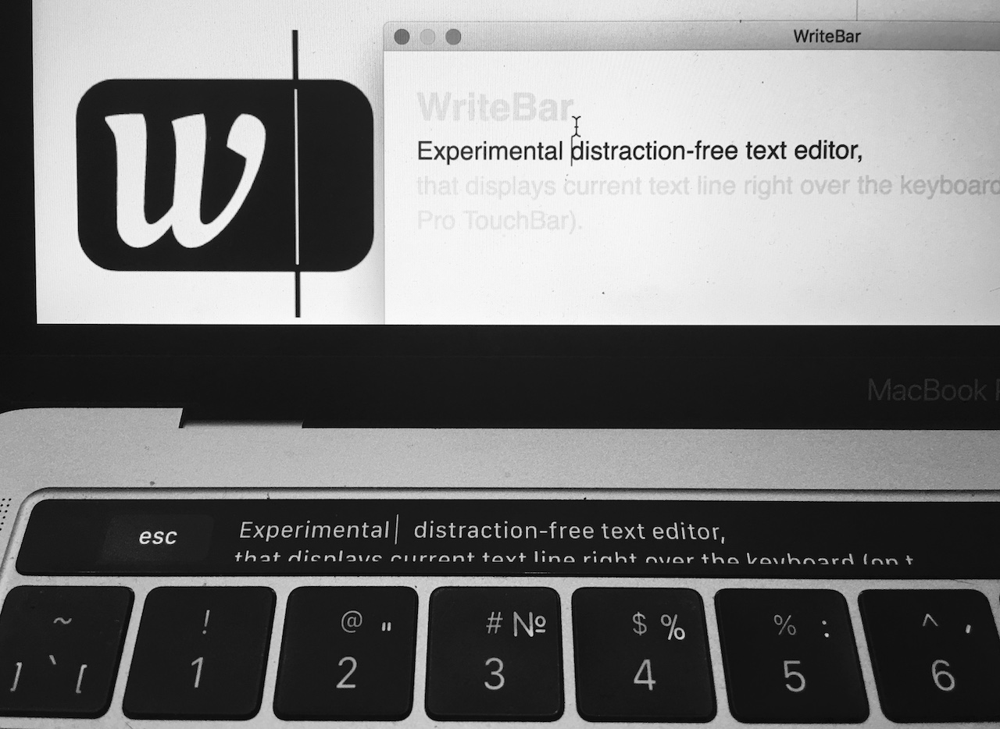

<p align="center"><a href="//writebar.js.org"></a></p>
<h1 align="center">WriteBar</h1>
<p align="center">
  Experimental distraction-free text editor,<br/>
  that displays focus text line right over the keyboard (on the Macbook Pro TouchBar).
</p>
<h2 align="center"><a href="//github.com/alexander-shvets/writebar/raw/master/dist/WriteBar.dmg">
  Download (dmg)
</a></h2>
<p align="center"></p>

### Discuss

- [Feature Requests and Issues](//github.com/alexander-shvets/writebar/issues)     
- [Intro post on UX Club](//facebook.com/groups/uxclubs/permalink/973396292808999/)

## Development

Download:    
```shell
git clone git@github.com:alexander-shvets/writebar.git
cd writebar
yarn
```

Install dev Dependencies:    
```shell
npm install -g electron
npm install -g electron-packager
npm install -g electron-installer-dmg
```

Run in dev mode:    
```shell
yarn start
```

Build App and Installer:    
```shell
yarn build
```
Release files generated in [`dist`](//github.com/alexander-shvets/writebar/tree/master/dist) directory.
